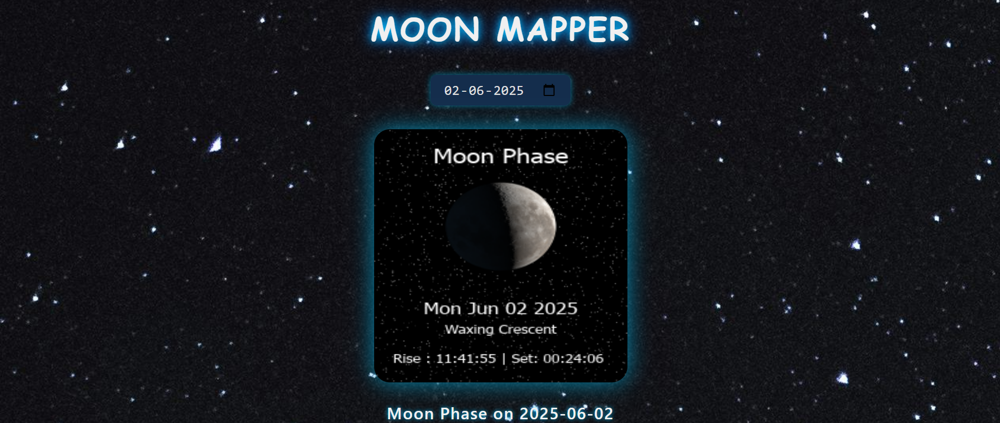

# 🌙 MoonMapper Web App

MoonMapper is a simple and elegant web app that shows you the **moon phase image** for any date you select. Just pick a date, and see the moon's current phase beautifully displayed!

---

## 🔭 Features

- Select any date to view the moon phase 🌕 for that day  
- Displays a high-quality moon phase image  
- Responsive design that works well on all devices 📱💻  
- Clean and dark-themed UI for a cosmic vibe 🌌  

---

## 🚀 How to Use

1. Open the app in your browser.  
2. Select a date using the date picker.  
3. The app will fetch and display the moon phase image for that date.  
4. See the moon phase name displayed below the image.  

---

## 💻 Technologies Used

- HTML5 & CSS3 for layout and styling  
- JavaScript (ES6) for interactivity and API calls  
- Node.js & Express.js backend to securely fetch data from AstronomyAPI  
- AstronomyAPI for moon phase data and images  

---

## 📸 Screenshot

---

## ⚙️ Setup Instructions (for developers)

1. Clone this repo  
2. Run the server (`node server.js`)  
3. Open `index.html` in a browser or use Live Server extension for local development  
4. Select dates and enjoy exploring moon phases!  

---

## 🌟 Future Improvements

- Add user location support for accurate moon phases worldwide  
- Animate the moon image with glowing or rotation effects  
- Add additional astronomy data (sun phases, constellations, etc.)  

---

## 🤝 Contributing

Feel free to open issues or submit pull requests to improve MoonMapper!

---

Made with 🌙 by Manasvi.
